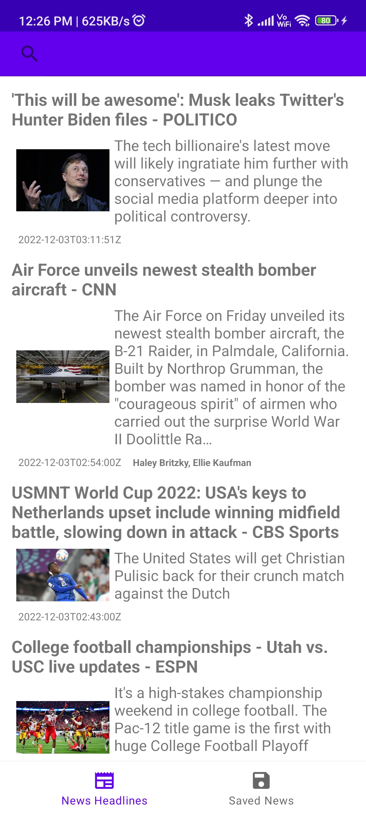
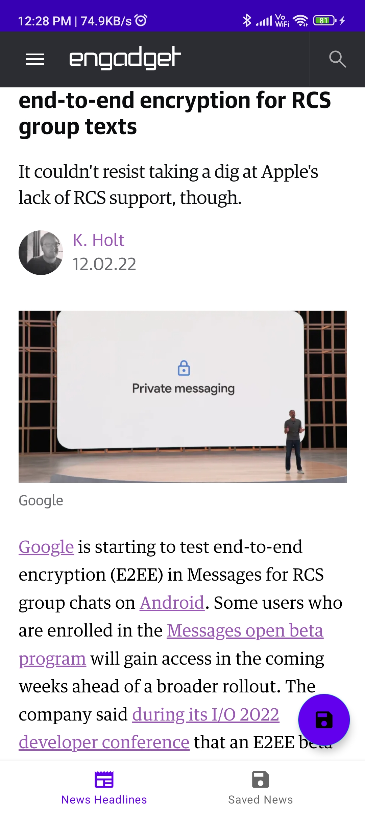

# News-App
This is the simple news app. The data is fetch from the api using retrofit. MVVM Clean architecture with jetpack compose is used for building this app. 

# Features and tech used

- Retrofit to fetch data from api
- Dagger-hilt For dependency injection
- Room-database For local data store
- Glide 
- Coroutines

## Screenshots

